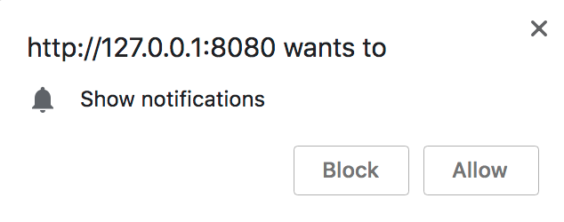

# Desktop Notifications Plugin

Show a desktop notification when a message is received
and app is not in focus.

## How to Implement

The desktop notification plugin is straight forward to implement. The following are supported and tested browsers:

| Browser   | Supported | Last Validated Version |
| :----------:|:---------:|:-----------------------:|
| Chrome    | Yes       | v.68                   |
| Firefox   | Yes       | v.61                   |
| Safari    | Yes       | v.11.1                 |
| Opera     | Yes       | v.55                   |
| IE        | ?         | N/a                    |

### Install Plugin

```bash
npm install chat-engine-desktop-notifications --save
```

### Plugin Configuration

CE currently supports the following options for displaying desktop notifications.

For additional configuration please refer to the following (MDN reference)[https://developer.mozilla.org/en-US/docs/Web/API/notification].

```js
let desktopNotificationsConfig = {
    title: (event) => {
        return '<INSERT_MSG_TITLE_HERE>'
    },
    message: (event) => {
        return event.data.text;   			// (default) displays CE message text for the room
    },
    icon: (event) => {
        return './pn-cloud.png';
    },
    callback: (event) => {
        window.focus();
    }
}
```

Then to initialize, attach the plugin to the ```ChatEngine.chat``` object:

```
ChatEngine.chat.plugin(
    ChatEngineCore.plugin['chat-engine-desktop-notifications'](desktopNotificationsConfig)
);
```

### Allow Desktop Notifications Prompt

By default, the CE desktop notification plugin handles the prompting the user to _Show Notifications_.

<div style="text-align:center"></div>

To instatiate this earlier, place the following snippet within your initiliztion code for CE:

```
Notification.requestPermission().then((res) => {
    console.log(res);
});
```
